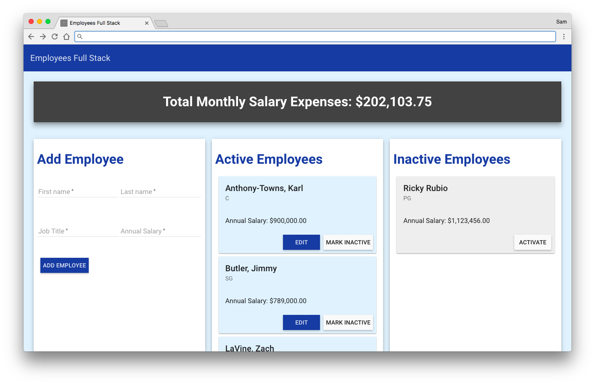

# Prime Weekend Challenge #4 - Employees Full Stack

This is a full stack web application that records employee records along with their salary. The app also adds up all active employee salaries to display how much total monthly salary is being spent. 

## Built With

* AngularJS
* Angular Material
* Node/Express
* AJAX
* PostgreSQL
* Heroku Deployment
## Getting Started 

Instructions to get the app running on your local machine. 

### Prerequisites

- [Node.js](https://nodejs.org/en/)
- [PostgreSQL](https://www.postgresql.org/)
### Installing

Create a PostgreSQL database for the app to interact with.

```sql
CREATE TABLE employees (
    id SERIAL PRIMARY KEY,
    first_name VARCHAR(80) NOT NULL,
    last_name VARCHAR(80) NOT NULL,
    job_title VARCHAR(80) NOT NULL,
    salary INT NOT NULL,
    is_active boolean DEFAUlT true NOT NULL,
    editing boolean DEFAULT false NOT NULL
);

```



## Authors

* Sam Fortin
